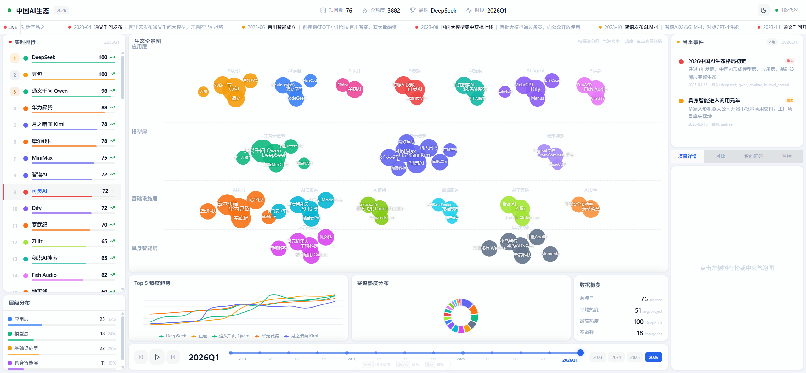
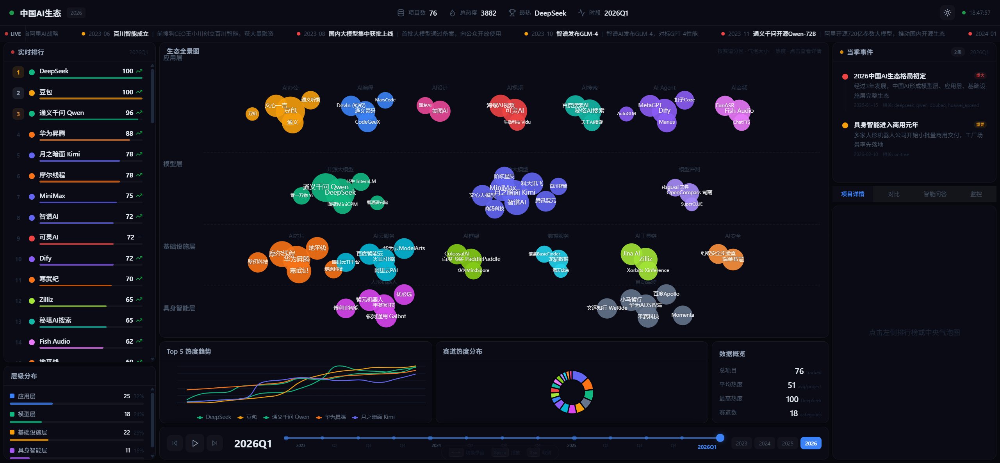
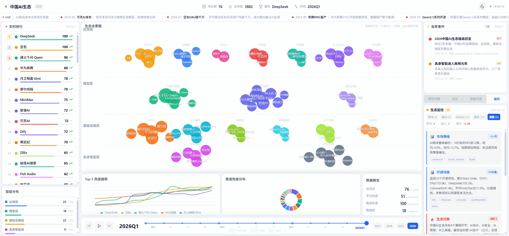
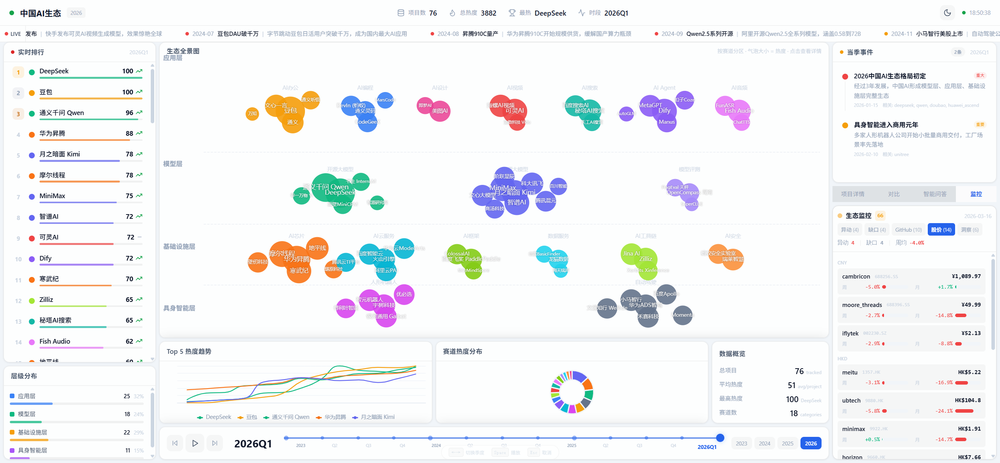
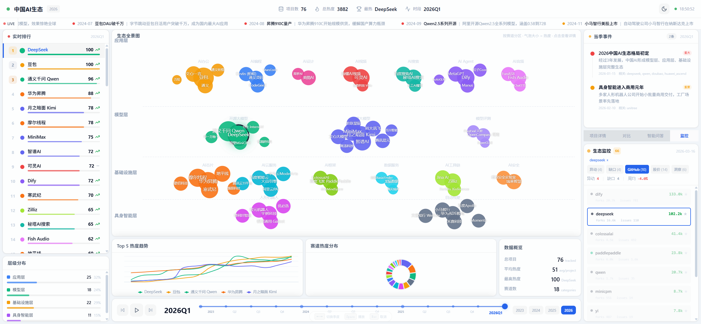
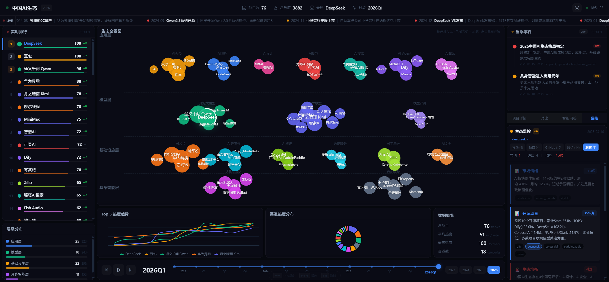

<div align="center">

# 2026 中国 AI 生态全景图

### China AI Ecosystem Landscape 2026

[](https://nextjs.org/)
[](https://www.typescriptlang.org/)
[](https://echarts.apache.org/)
[](https://tailwindcss.com/)
[](./LICENSE)

**一站式可视化仪表盘，实时呈现中国人工智能产业版图**

`76 个项目` &bull; `18 条赛道` &bull; `4 大层级` &bull; `13 个季度时间轴`

---



<br />



<sub>支持亮色 / 暗色主题一键切换</sub>

</div>

---

## 功能亮点

<table>
<tr>
<td width="50%">

### 生态气泡图
按赛道分区的全景气泡图，气泡大小 = 热度，点击查看项目详情，支持缩放和拖拽。

### 实时排行榜
76 个项目按热度实时排名，支持点击选中全局联动——气泡图高亮、监控面板筛选、详情面板同步。

### 时间轴推演
从 2023Q1 到 2026Q1，13 个季度的中国 AI 发展历程。支持自动播放、键盘切换、26 条关键事件展示。

</td>
<td width="50%">

### 生态监控面板
- **健康指数**：100 分制动态评分
- **异动追踪**：GitHub / 股价异常自动捕获
- **缺口分析**：对标全球生态发现薄弱赛道
- **多维洞察**：市场情绪、开源动量、板块轮动、集中度风险等 6+ 条专业分析

### 更多模块
- **项目对比**：任选两个项目对比热度趋势
- **赛道分层**：四大层级分布统计
- **AI 问答**：基于项目数据的智能对话
- **LIVE 新闻条**：关键事件滚动展示

</td>
</tr>
</table>

---

## 监控面板展示

<table>
<tr>
<td width="50%" align="center">

<br />
<sub>多维洞察分析 — 市场情绪 / 开源动量 / 缺口分析 / 板块轮动</sub>
</td>
<td width="50%" align="center">

<br />
<sub>股价监控 — 14 只标的实时跟踪，按币种分组</sub>
</td>
</tr>
<tr>
<td width="50%" align="center">

<br />
<sub>项目联动 — 选中 DeepSeek 后全局高亮</sub>
</td>
<td width="50%" align="center">

<br />
<sub>暗色模式 — 洞察面板</sub>
</td>
</tr>
</table>

---

## 快速开始

### 环境要求

- Node.js 18+
- npm 或 yarn

### 安装 & 运行

```bash
# 克隆仓库
git clone https://github.com/PingPig/china-ai-landscape.git
cd china-ai-landscape

# 安装依赖
npm install

# 开发模式
npm run dev
# 打开 http://localhost:3000

# 生产构建
npm run build
npm start -- -p 4000
# 打开 http://localhost:4000
```

### 配置 AI 问答（可选）

```bash
cp .env.local.example .env.local
# 编辑 .env.local，填入你的 OpenRouter API Key
# 获取地址: https://openrouter.ai/keys
```

---

## 数据采集

项目内置数据采集脚本，用于更新 GitHub 和股价监控数据：

```bash
# 一键采集全部 + 生成洞察
node scripts/collect-all.js

# 或分别运行：
node scripts/collect-github.js    # GitHub Stars/Forks/Issues
node scripts/collect-stocks.js    # 股价数据 (Yahoo Finance)
node scripts/generate-insights.js # 仅重新生成洞察
```

采集配置位于 `src/data/monitor-config.json`，可自行添加或修改监控目标。

---

## 键盘快捷键

| 按键 | 功能 |
|:----:|------|
| `←` `→` | 切换季度 |
| `Space` | 播放 / 暂停时间轴 |
| `Esc` | 取消选中项目 |

---

## 项目结构

```
china-ai-landscape/
├── src/
│   ├── app/                  # Next.js App Router
│   │   ├── api/analyze/      # AI 问答 API 路由
│   │   ├── page.tsx          # 首页
│   │   └── globals.css       # 全局样式 + CSS 变量
│   ├── components/
│   │   ├── dashboard.tsx     # 主仪表盘布局
│   │   └── dashboard/        # 子组件
│   │       ├── bubble-panel.tsx      # 气泡图
│   │       ├── ranking-panel.tsx     # 排行榜
│   │       ├── monitor-panel.tsx     # 生态监控
│   │       ├── timeline-bar.tsx      # 时间轴
│   │       ├── layer-breakdown.tsx   # 层级分布
│   │       ├── compact-compare.tsx   # 项目对比
│   │       ├── ai-chat.tsx           # AI 问答
│   │       └── ...
│   ├── data/                 # 静态数据文件
│   │   ├── projects.json     # 76 个项目数据
│   │   ├── timeline-events.json  # 26 条时间线
│   │   ├── monitor-*.json    # 监控数据
│   │   └── METHODOLOGY.md    # 数据方法论
│   └── lib/
│       └── types.ts          # TypeScript 类型定义
├── scripts/                  # 数据采集脚本
├── public/                   # 静态资源
└── package.json
```

---

## 数据说明

| 数据类型 | 来源 | 更新频率 |
|---------|------|---------|
| 项目信息 | 公开资料（官网、融资新闻、产品发布） | 手动维护 |
| GitHub 数据 | GitHub REST API（Stars、Forks、Issues） | 建议每周采集 |
| 股价数据 | 公开金融数据接口（实时价格、涨跌幅） | 建议每周采集 |
| 热度指数 | 多维度综合评估（0-100） | 参见 [`METHODOLOGY.md`](src/data/METHODOLOGY.md) |
| AI 洞察 | 基于采集数据自动生成 | 每次采集后 |

---

## 隐私声明

本项目：

- **不收集任何用户个人数据** — 纯前端静态应用，无用户注册、无 Cookie 追踪、无数据上报
- **不存储用户行为** — 所有交互仅在浏览器本地完成
- **数据均来自公开渠道** — GitHub API（公开仓库数据）、公开金融数据接口（上市公司股价）
- **AI 问答功能**（可选）— 如启用，用户输入的问题会发送至 OpenRouter API 处理，请参阅 [OpenRouter 隐私政策](https://openrouter.ai/privacy)
- **不包含任何商业机密或非公开信息**

## 免责声明

- 本项目仅供**学习和研究目的**，不构成任何投资建议
- 股价数据可能存在延迟，不应作为交易依据
- 热度指数为主观评估，仅反映编者观点
- 项目信息基于公开资料整理，可能存在遗漏或偏差
- 所有公司名称、产品名称和商标均属于其各自所有者

## 开源协议

本项目采用 [MIT License](./LICENSE) 开源。你可以自由地使用、复制、修改和分发本项目，唯一要求是保留版权声明。

## 贡献

欢迎提交 Issue 和 Pull Request！如果你想添加新的 AI 项目：

1. 编辑 `src/data/projects.json` 添加项目数据
2. 运行 `node scripts/recalc-heat-v2.js` 重新计算热度
3. 提交 PR

## 致谢

- [Next.js](https://nextjs.org/) — React 全栈框架
- [ECharts](https://echarts.apache.org/) — 数据可视化库
- [Tailwind CSS](https://tailwindcss.com/) — 实用优先 CSS 框架
- [Framer Motion](https://www.framer.com/motion/) — React 动画库
- [OpenRouter](https://openrouter.ai/) — AI 模型聚合 API

---

<div align="center">
<sub>Built with Next.js + ECharts + Tailwind CSS</sub>
</div>
